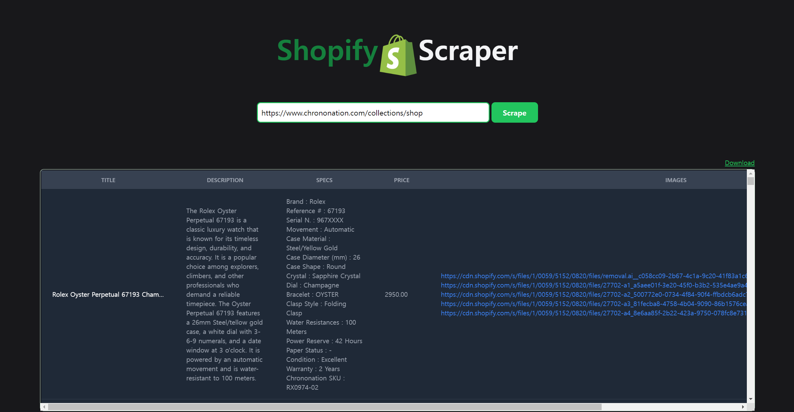

#   Shopify-Scraper 

[//]: # ([![forthebadge]&#40;https://forthebadge.com/images/badges/open-source.svg&#41;]&#40;https://forthebadge.com&#41;)

[](https://forthebadge.com)
[](https://forthebadge.com)

This project is a web application that scrapes shopify products that provide public information. 



This scraper will extract the following information from the shopify site:
- Title
- Description
- Specs
- Price
- Images

---

[//]: # (## Updated Features)
[//]: # (2024.09.04)
[//]: # (  - **Company Search:** You can search for a company and get all the employees' information.)

## Stacks
```angular2html
Django 5.0.7
Python 3.10.11
tailwindcss 3.0.0
beautifulsoup4 4.12.3
```
  
## How to Run 

- Clone the repository
- Install Requirements
```bash
$ pip install -r requirements.txt
```
-  Run Django Server
```bash
$ python manage.py runserver
```

- Tailwind Build (for dev)
```bash
$ npx tailwindcss -i ./static/src/input.css -o ./static/src/output.css --watch
```

## Contact

For any feedback or queries, please reach out to me at [kimyk0120@gmail.com](kimyk0120@gmail.com).

